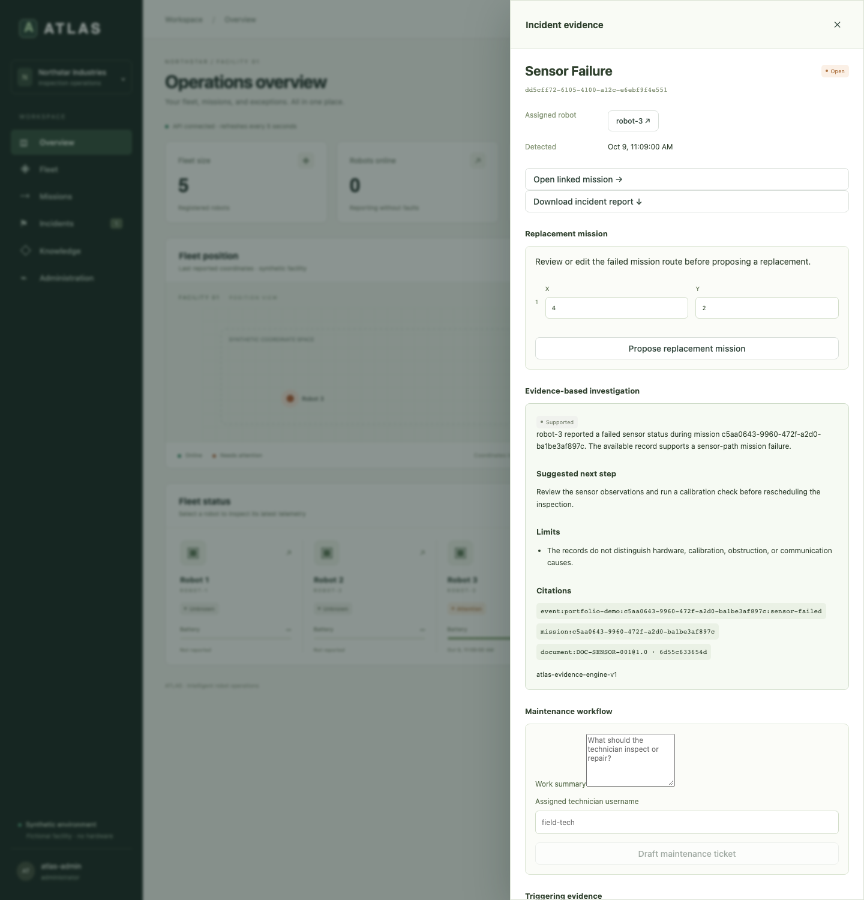
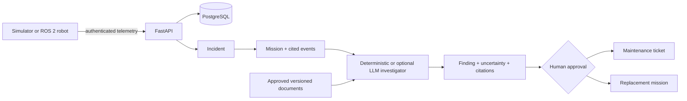

# ATLAS — Understand why a robot mission failed

[](https://github.com/ParsaDj/ATLAS/actions/workflows/tests.yml)
[](https://github.com/ParsaDj/ATLAS/actions/workflows/compose-smoke.yml)
[](LICENSE)

ATLAS is an independent, open-source robotics operations platform for a
fictional industrial inspection fleet. It turns robot telemetry, mission state,
operational events, approved technical guidance, and maintenance history into
an evidence-backed incident workflow.

The project uses only simulated robots and synthetic industrial data. It does
not contain employer code, customer information, proprietary models, or real
robot telemetry.



*A real browser run against the synthetic ATLAS API. Robot 3 reports a sensor
failure; the investigation cites the exact event, mission, and approved guide
while preserving uncertainty and human approval. [Reproduce this
capture](docs/demo-artifacts.md).*

## The problem

When a robot fails in the field, an engineer may need to correlate mission
history, ROS events, telemetry, logs, technical documentation, and earlier
maintenance work before deciding what to do next. Those records often live in
different systems, and the most recent error is not necessarily the root cause.

ATLAS explores one focused question:

> Can an operations platform reconstruct a robot failure from authorized
> evidence, explain what the evidence supports, and preserve human approval for
> every operational write?

The initial user is a small team operating a fleet of ROS 2 mobile robots. The
first version models one customer, one facility, and five robots.

## A concrete failure

In the reproducible demo, Robot 3 begins an inspection mission and reports a
failed sensor state on its fourth update. ATLAS then:

```text
sensor_status=failed
        ↓
stores the telemetry event exactly once
        ↓
fails the active mission in the same database transaction
        ↓
creates one sensor_failure incident
        ↓
loads the triggering event, mission, and approved sensor guide
        ↓
produces a bounded finding with event and document citations
        ↓
waits for a human to approve maintenance or a replacement mission
```

The investigation can support **a fault somewhere in the sensor path**. It does
not claim that the evidence distinguishes hardware failure, obstruction,
calibration drift, or a transient communication problem. That uncertainty is
part of the result.

## ATLAS in 60 seconds

1. An operator creates and separately approves an inspection mission.
2. A simulator or ROS 2 bridge sends authenticated telemetry with stable event
   identifiers.
3. The API validates freshness and mission ownership, stores the event, updates
   robot state, and applies deterministic fault rules transactionally.
4. A fault creates an incident linked to the affected mission and triggering
   evidence.
5. The investigation engine retrieves only those authorized records and the
   latest approved technical-document revisions for the fault.
6. ATLAS returns a finding, confidence, limitations, recommended action, exact
   citations, and a read-only tool trace.
7. A human may approve a maintenance ticket or replacement mission. Every
   action is attributed in the audit log and can appear in a customer report.



## Implemented capabilities

- Five-robot synthetic fleet with scheduled missions, waypoint progress, fault
  injection, heartbeat monitoring, and reproducible outcomes.
- FastAPI and PostgreSQL backend with Alembic migrations, normalized query
  indexes, explicit mission transitions, transaction boundaries, and duplicate
  protection.
- React and TypeScript operations dashboard for fleet status, missions,
  incidents, evidence, technical documents, approvals, users, and audit history.
- Deterministic evidence-grounded investigation plus an optional model-backed
  adapter with strict structured output, citation allowlisting, immutable
  document revisions, SHA-256 provenance, and a safe offline fallback.
- Human-approved maintenance tickets, replacement missions, and escaped
  printable incident and mission reports.
- ROS-independent bridge core with machine authentication, stable event IDs,
  mission polling, and a durable SQLite outbox for interrupted connectivity.
- ROS 2/Nav2 adapter that maps approved missions to `NavigateThroughPoses` and
  translates odometry, battery, diagnostics, and action results into ATLAS.
- Structured logs, correlation IDs, Prometheus metrics, readiness checks, and
  optional OpenTelemetry OTLP trace export. The dashboard, `/version` endpoint,
  demo artifacts, and benchmark reports expose the running build revision so
  operational evidence can be tied back to source.
- Local authentication, role-based authorization, CSRF protection, login
  throttling, authenticated operational reads, audit logs, browser security
  headers, and secure-cookie support. The tested threat model maps abuse cases
  to controls and residual risks.

## Engineering decisions worth inspecting

### 1. State changes and evidence commit together

Telemetry insertion, robot snapshot updates, incident creation, and mission
failure occur in one transaction. PostgreSQL row locks serialize competing
updates; SQLite uses `BEGIN IMMEDIATE` for the local single-worker demo. A fault
cannot be visible without its triggering evidence also being committed.

### 2. Delivery is idempotent and replayable

Each telemetry event has a caller-generated identifier. Identical delivery is a
successful duplicate; reuse of the identifier with different content is a
conflict. The ROS bridge writes observations to a durable outbox before network
delivery, then safely retries them after an outage.

### 3. Investigation is separated from authority

The API selects the incident, mission, cited events, and approved document
revisions. The investigator receives those records without a database session
or write tools. It cannot command a robot, create a ticket, approve a mission,
or override a safety rule. Operational writes remain explicit server workflows
with role checks, CSRF protection, human approval, and audit attribution.

### 4. Uncertainty and provenance are product behavior

Findings cite exact event IDs and document versions with content hashes. Missing
referenced evidence produces an insufficient result. The engine distinguishes
what the records establish from plausible causes that they cannot establish.
The deterministic implementation creates a measurable baseline for the
optional model adapter. The model receives only the incident envelope selected
by the API: its linked mission, cited events, and approved technical-document
revisions. Its response must match a closed JSON schema and cite only IDs in
that envelope. Fabricated citations, missing required operational evidence,
malformed output, timeouts, and provider errors return the deterministic
baseline. Prompt, model, document, and evidence-envelope versions remain in the
result.

## Reliability evidence

The test suite contains examples intended to demonstrate operational guarantees,
not just endpoint coverage:

- concurrent approvals allow exactly one mission transition;
- concurrent delivery of one event stores it once;
- stale telemetry remains queryable but cannot regress live robot state;
- cancellation racing telemetry cannot resurrect a mission;
- simultaneous sensor and battery faults commit both incidents;
- an interrupted bridge retains events and replays them without duplication;
- missing cited evidence forces an insufficient investigation.

The current verification includes **249 Python tests**, **120 reproducible
investigation cases**, **50 generated state-machine traces**, **10 browser
workflows**, and **1 isolated portfolio capture**. GitHub Actions runs backend
behavior against SQLite and PostgreSQL 17 and runs the dashboard against a real
API. Detailed scope and limitations are recorded in
[docs/evaluation.md](docs/evaluation.md).
Security assumptions and adversarial coverage are documented in
[docs/security/threat-model.md](docs/security/threat-model.md).
Operational invariants and generated sequences are documented in
[docs/reliability.md](docs/reliability.md).
The reproducible load framework and interpretation limits are documented in
[docs/performance.md](docs/performance.md).
The optional live-model benchmark, frozen dataset, and scoring limits are in
[docs/live-model-evaluation.md](docs/live-model-evaluation.md).
Every dashboard CI run also captures a short browser recording, screenshot,
incident report, and evidence summary for the Robot 3 failure story; see
[docs/demo-artifacts.md](docs/demo-artifacts.md).
Production configuration guards and the remaining deployment review are in
[docs/deployment-security.md](docs/deployment-security.md).
Tagged releases matching [`VERSION`](VERSION) publish a tested source archive,
SHA-256 checksums, and a per-file release manifest tied to the exact commit.

## What ATLAS does not do yet

- It is not a physical robot safety controller and never sends raw motor
  commands.
- The optional LLM investigator requires a separately configured hosted or
  local JSON-schema-capable model. Its contract, adversarial behavior, and
  evaluation runner are tested, but no live-model result is published yet.
- The ROS 2/Nav2 adapter has unit and contract coverage, but its Gazebo runtime
  acceptance sequence still requires Ubuntu 24.04, ROS 2 Jazzy, and Gazebo
  Harmonic.
- The heartbeat monitor and login limiter are process-local. This release runs
  one API worker and is not a horizontally scaled deployment.
- Scale testing is limited to the synthetic portfolio environment.
- Docker Compose is validated as a single-host demonstration, including
  database/API restart recovery and a small telemetry benchmark smoke run. It
  has not been validated as a distributed or production deployment.
- The local account system is not enterprise identity management.
- The coordinate view is synthetic and is not a surveyed facility map.

## Quick start: run the failure demo

The shortest complete path uses Docker Compose. It builds the dashboard, starts
PostgreSQL, applies migrations, injects Robot 3's sensor failure, verifies the
evidence contract, and stops at the human maintenance-approval boundary. The UI
is available at [http://127.0.0.1:8000](http://127.0.0.1:8000).

```sh
git clone https://github.com/ParsaDj/ATLAS.git
cd ATLAS
docker compose up --build -d db api
docker compose --profile demo run --rm failure-demo
```

The terminal prints seven checkpoints from mission approval through the draft
maintenance ticket. Sign in with the local demo account:

```text
Username: atlas-admin
Password: atlas-local-demo-password
```

Open **Incidents**, select Robot 3's sensor incident, and choose **Investigate
incident**. The result cites the triggering event, failed mission, and approved
`DOC-SENSOR-001` revision while preserving uncertainty about the underlying
sensor cause.

The default demonstration leaves maintenance in `draft`. Run a fresh scenario
with an explicit approval action using:

```sh
docker compose --profile demo run --rm -e ATLAS_DEMO_APPROVE=1 failure-demo
```

The complete recording storyboard and supported claims are in
[docs/demo.md](docs/demo.md). The full five-robot, 50-second fleet scenario
remains available with:

```sh
docker compose --profile demo run --rm simulator
```

Expected full-fleet outcomes:

| Robot | Result |
| --- | --- |
| Robot 1 | Mission completed |
| Robot 2 | Low-battery incident; mission failed |
| Robot 3 | Sensor-failure incident; mission failed |
| Robot 4 | Disconnection incident; mission failed |
| Robot 5 | Mission completed |

The Compose credentials are intentionally local demonstration values. Replace
them before any shared deployment. Stop the stack with:

```sh
docker compose down
```

The `atlas-data` volume preserves PostgreSQL data. Use `docker compose down -v`
only when you intentionally want a fresh demo database.

### Optional model-backed investigation

ATLAS uses the deterministic investigator unless explicitly enabled. To use a
compatible model endpoint, set these values before starting the API:

```sh
export ATLAS_INVESTIGATOR_MODE=llm
export ATLAS_LLM_API_KEY='your-provider-key'
export ATLAS_LLM_MODEL='your-json-schema-capable-model'
export ATLAS_LLM_BASE_URL='https://api.openai.com/v1'
```

The model endpoint must implement the OpenAI-compatible chat-completions JSON
schema response format. The API key stays server-side. If configuration is
absent, ATLAS does not contact an external model provider.

## Local development without Docker

Requires Python 3.11+; the current suite is tested with Python 3.13.

```sh
python3 -m venv .venv
source .venv/bin/activate
pip install -r requirements.txt
alembic upgrade head
export ATLAS_BOOTSTRAP_ADMIN_PASSWORD='choose-at-least-12-characters'
export ATLAS_TELEMETRY_API_KEY='choose-a-long-random-bridge-key'
uvicorn apps.api.main:app --host 127.0.0.1 --port 8000
```

Run the fault simulator in another terminal using the same telemetry key and
the administrator password created on first startup:

```sh
source .venv/bin/activate
export ATLAS_OPERATOR_PASSWORD='choose-at-least-12-characters'
export ATLAS_TELEMETRY_API_KEY='choose-a-long-random-bridge-key'
python -m simulator.fleet
```

To serve the dashboard, install Node.js 22.12+ and pnpm 11.25.0, then build it
before starting the API:

```sh
cd apps/dashboard
pnpm install --frozen-lockfile
pnpm build
cd ../..
```

Open `/docs` for the interactive API. `/health` reports process liveness,
`/ready` verifies database access, and `/metrics` exposes Prometheus text
metrics. `/version` identifies the application and injected build revision.
`.env.example` documents configuration; the application does not load that file
automatically.

For dashboard-created healthy missions, run the resumable operations worker:

```sh
ATLAS_TELEMETRY_API_KEY='choose-a-long-random-bridge-key' \
  .venv/bin/python -m simulator.worker
```

Do not run the healthy worker and fault simulator against the same facility at
the same time.

## Run the tests

```sh
.venv/bin/python -m pytest -q

cd apps/dashboard
pnpm exec playwright install chromium
ATLAS_TEST_PYTHON=../../.venv/bin/python pnpm test:e2e
```

For PostgreSQL coverage, set `ATLAS_TEST_POSTGRES_URL` to a test database whose
user may create schemas. Each test uses and removes a unique temporary schema.

## ROS 2 integration status

`robotics/atlas_bridge` is the tested ROS-independent transport and mission
coordination layer. `robotics/atlas_ros` is the `rclpy`/Nav2 wrapper for one
robot. The remaining runtime validation covers a successful waypoint mission,
active cancellation, navigation failure, bridge restart, and offline outbox
replay in Gazebo. See [docs/ros2-integration.md](docs/ros2-integration.md) for
the environment and acceptance sequence.

## Repository map

- `apps/api/` — FastAPI workflows, persistence, reports, security, and
  observability.
- `apps/ai_agent/` — deterministic evidence engine and bundled approved guides.
- `apps/dashboard/` — React/TypeScript customer operations interface.
- `simulator/` — focused failure story, five-robot fault demo, and healthy
  mission worker.
- `robotics/atlas_bridge/` — reliable ROS-independent transport core.
- `robotics/atlas_ros/` — ROS 2 subscriptions and Nav2 action adapter.
- `migrations/` — reviewed Alembic schema history for SQLite and PostgreSQL.
- `tests/` — unit, integration, generated state-machine, concurrency, workflow,
  and evaluation coverage.
- `docs/` — demo storyboard, architecture, requirements, safety boundaries,
  evaluation, and ROS acceptance documentation.

## License and safety boundary

ATLAS is available under the [Apache License 2.0](LICENSE). See
[CONTRIBUTING.md](CONTRIBUTING.md) and [SECURITY.md](SECURITY.md) before
contributing or deploying it.

This is a synthetic portfolio system. Its measurements do not establish the
safety or reliability of a physical robot or industrial facility.
