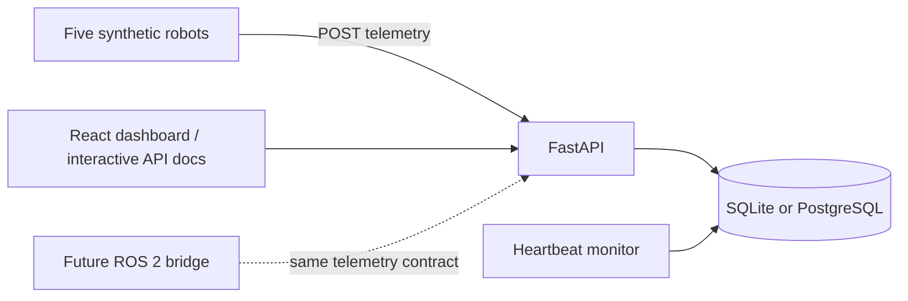

# Architecture

## Telemetry contract

Each event has a caller-generated unique `event_id`, registered `robot_id`, timezone-aware `occurred_at`, position, battery percentage, sensor status, and optional mission ID. The backend adds `received_at`. UTC-normalized event time determines whether a sample can update the robot snapshot. Identical retries return `duplicate: true`; reuse of an event ID with another payload returns 409. Duplicate retries do not update liveness.

Telemetry for an unapproved, nonexistent, or differently assigned mission is rejected. Late records are stored but do not regress the current snapshot or generate historical fault incidents. Samples more than 15 seconds old are historical-only, even if no previous sample exists; they cannot claim a live robot connection. Records for a prior mission cannot mutate current robot state. This prototype assumes an ordered live producer; historical incident reconstruction is deferred.

## State and transactions

Missions transition `pending → running → completed|failed`. Pending or running missions may also become `cancelled`, with a required nonblank reason. Cancellation keeps telemetry and never resurrects the mission. Approval starts the synthetic mission; there is no physical dispatch. Only one mission may be running for a robot. Failed, cancelled and completed missions stay terminal; recovered connectivity does not resurrect a mission. Create a new mission to retry.

Telemetry insertion, snapshot update, incident creation, and failure transition share one database transaction. A unique telemetry primary key and incident deduplication key protect retries. Per-mission fault keys collapse repeated samples for the same fault into one incident. For unassigned robots, fault incidents deduplicate by event ID only; fault episode grouping is deferred.

PostgreSQL uses robot row locks to serialize conflicting writes. SQLite uses `BEGIN IMMEDIATE` transactions because it lacks equivalent row locks. SQLite is intended for the small local demo, not high-throughput ingestion. Mission, robot, telemetry, and incident payloads currently use JSON columns; schema normalization, foreign keys, indexes, and migrations should precede larger datasets.

## Fault rules

- Battery below 20%: low battery incident.
- Sensor status `failed`: sensor failure incident. If a sample also reports low battery, both faults create incidents in the same transaction.
- No fresh heartbeat for more than 15 seconds: disconnection incident, checked every five seconds.
- An approved mission with no first heartbeat also times out, using approval time as its initial reference. This applies even when the robot was already disconnected before approval.

The heartbeat monitor runs inside one API process. Do not use multiple workers for this prototype. Database exceptions are logged and retried at the next interval. A separate scheduled worker and explicit watchdog health should precede production deployment.

## API

`GET /health`; `GET /api/robots`; `GET /api/robots/{id}`; `GET /api/robots/{id}/telemetry?limit=100`; `GET /api/missions`; `POST /api/missions`; `GET /api/missions/{id}`; `POST /api/missions/{id}/approve`; `POST /api/missions/{id}/cancel`; `GET /api/events`; `GET /api/events/{event_id}`; `POST /api/telemetry`; `GET /api/incidents`; `GET /api/incidents/{id}`.

OpenAPI schemas and request examples are available at `/docs`. Investigation and ticket endpoints are intentionally deferred until their services exist.

List endpoints for missions, events, incidents and robot telemetry support bounded limit/offset pagination with deterministic ordering. Event and incident lists filter by robot or mission; mission lists filter by robot and state. Offset pagination is a local-demo convenience; concurrently arriving data can shift page boundaries. Cursor pagination and indexed normalized columns remain future work.

## Customer dashboard

React/TypeScript lives in `apps/dashboard`. Vite builds static assets; FastAPI mounts them at `/` when the build directory exists, after registering API routes. The Dockerfile builds the frontend in a Node stage and copies only its compiled assets into the Python runtime. During development Vite proxies API requests to port 8000.

The UI polls every five seconds with non-overlapping requests per resource and aborts requests when a view changes. Failed refreshes retain the last successful data and explicitly mark it stale. Native modal dialogs keep keyboard focus inside the selected workflow. Creating a mission saves a pending proposal; a separate approval action begins execution. Mutations are disabled while pending and the backend validates all state transitions.

Incident details retrieve referenced evidence separately from the paginated event timeline. Missing evidence is an error state, never replaced with an AI explanation. The coordinate plot uses last reported positions; it is not a navigation map.
