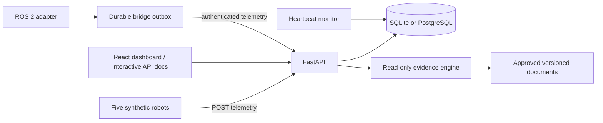

# Architecture

## Telemetry contract

Each event has a caller-generated unique `event_id`, registered `robot_id`, timezone-aware `occurred_at`, position, battery percentage, sensor status, and optional mission ID. The backend adds `received_at`. UTC-normalized event time determines whether a sample can update the robot snapshot. Identical retries return `duplicate: true`; reuse of an event ID with another payload returns 409. Duplicate retries do not update liveness.

Telemetry for an unapproved, nonexistent, or differently assigned mission is rejected. Late records are stored but do not regress the current snapshot or generate historical fault incidents. Samples more than 15 seconds old are historical-only, even if no previous sample exists; they cannot claim a live robot connection. Records for a prior mission cannot mutate current robot state. This prototype assumes an ordered live producer; historical incident reconstruction is deferred.

## State and transactions

Missions transition `pending → running → completed|failed`. Pending or running missions may also become `cancelled`, with a required nonblank reason. Cancellation keeps telemetry and never resurrects the mission. Approval starts the synthetic mission; there is no physical dispatch. Only one mission may be running for a robot. Failed, cancelled and completed missions stay terminal; recovered connectivity does not resurrect a mission. Create a new mission to retry.

Telemetry insertion, snapshot update, incident creation, and failure transition share one database transaction. A unique telemetry primary key and incident deduplication key protect retries. Per-mission fault keys collapse repeated samples for the same fault into one incident. For unassigned robots, fault incidents deduplicate by event ID only; fault episode grouping is deferred.

PostgreSQL uses robot row locks to serialize conflicting writes. SQLite uses `BEGIN IMMEDIATE` transactions because it lacks equivalent row locks. SQLite is intended for the small local demo, not high-throughput ingestion. API payloads remain in JSON columns, while immutable mission, telemetry, and incident identifiers and timestamps are also stored in indexed relational columns. Robot and mission foreign keys protect references, and an Alembic backfill preserves existing JSON records.

## Schema migrations

Alembic owns the database schema. The API startup path never calls `create_all`; after migrations are applied, it only inserts any missing synthetic robot seed records. The initial revision creates robots, missions, telemetry, and incidents plus Alembic's version table on both SQLite and PostgreSQL. It can adopt a pre-Alembic ATLAS database when the existing table columns match the expected legacy schema, without changing its operational data.

Local and CI tests migrate each isolated database before creating the application. The Docker image runs `alembic upgrade head` before Uvicorn, after Compose has confirmed PostgreSQL is healthy. Future model changes require a reviewed revision rather than implicit startup DDL.

## Authentication and audit

Human workflows use local accounts with `operator`, `technician`, or `administrator` roles. Passwords are stored as salted scrypt hashes. A successful login creates an eight-hour random server-side session; the browser receives only an HttpOnly, SameSite=Strict cookie and a separate per-session CSRF token. Mission writes require operator or administrator access plus the CSRF header. Incident investigation accepts any authenticated role. User creation and audit retrieval require an administrator.

Authentication attempts are limited per direct client address to five failures
in a rolling five-minute window. A blocked response includes `Retry-After`, a
successful login clears the failure history, and unknown or inactive accounts
still perform password-hash verification to reduce username timing leakage.
This limiter is process-local because the prototype intentionally runs one API
worker. A distributed deployment requires a shared or gateway-level limiter.

Responses deny framing and MIME sniffing, restrict referrer and browser feature
access, isolate the opener, and apply route-appropriate Content Security Policy.
HTTPS responses include one-year HSTS. The interactive API documentation permits
only its required documentation CDN resources; application routes use same-origin
scripts and resources.

Mission creation, approval, cancellation, incident investigation, user creation, login, and logout write append-only audit records. Domain mutations and their audit records share the same database transaction. Audit entries contain actor, action, resource, timestamp, and bounded operational details; they never contain passwords, session tokens, or CSRF tokens. Robot telemetry uses a separate machine credential in the `X-ATLAS-Bridge-Key` header and never reuses a human session or CSRF token. The API fails closed when the bridge key is not configured. The local demo uses one facility-wide key; per-robot credentials and rotation are required before a remote or physical deployment.

Maintenance tickets transition `draft → approved → in_progress → resolved`. Operators and administrators create and approve tickets. Technicians can start and resolve only work assigned to their account; administrators may act as an operational override. Resolving a ticket and its linked incident occurs in one transaction. Every transition is audited with the human actor. One incident can have only one maintenance ticket in this version.

Incident and mission reports are generated from records loaded under the authenticated user's server session. Report generation is audited. The HTML renderer escapes every record value, includes a synthetic-data limitation, and presents recorded facts separately from investigation findings, confidence, limitations, and citations. Reports are generated on demand and are not retained as mutable database blobs.

A replacement mission is a normal pending mission with immutable links to its failed source mission and incident plus the proposing user. Operators and administrators may edit the copied waypoint list and propose it; the existing mission-approval transition remains a separate action. An incident can have only one pending, running, or completed replacement. Failed or cancelled replacements permit another proposal. The incident row lock serializes competing proposals.

## Robotics bridge

`robotics/atlas_bridge` separates ROS message handling from API delivery. Its core polls the single running mission assigned to a robot and generates deterministic event identifiers from robot ID, ROS timestamp, and an observation sequence. Every event enters a local SQLite outbox before transmission. Successful and duplicate deliveries are acknowledged; network failures, authentication errors, throttling, and server errors remain queued. Other client errors are quarantined with a bounded reason so one invalid event cannot block subsequent telemetry.

The outbox is a delivery mechanism rather than a safety controller. Nav2 remains responsible for motion execution and obstacle handling. The `atlas_ros` node subscribes to odometry, battery, and diagnostics and translates approved mission waypoints into a `NavigateThroughPoses` action. Mission removal cancels the active goal. A successful result completes the mission; a rejected or aborted goal records a navigation-failure incident. ATLAS cannot publish raw motor commands.

## Fault rules

- Battery below 20%: low battery incident.
- Sensor status `failed`: sensor failure incident. If a sample also reports low battery, both faults create incidents in the same transaction.
- No fresh heartbeat for more than 15 seconds: disconnection incident, checked every five seconds.
- An approved mission with no first heartbeat also times out, using approval time as its initial reference. This applies even when the robot was already disconnected before approval.

The heartbeat monitor runs inside one API process. Do not use multiple workers for this prototype. Database exceptions are logged and retried at the next interval. A separate scheduled worker and explicit watchdog health should precede production deployment.

## Observability

Each HTTP request receives an `X-Request-ID` response header and a server span. Valid caller-supplied IDs are retained; other values are replaced. Structured JSON completion logs contain only the method, matched route template, status, duration, request ID, and trace ID. They omit headers, query strings, request bodies, credentials, and telemetry payloads.

OpenTelemetry uses the `atlas-api` service resource. Setting `OTEL_EXPORTER_OTLP_ENDPOINT` enables batched OTLP/HTTP trace export; without it, span creation has no external dependency. `/health` reports process liveness, while `/ready` checks database connectivity. `/metrics` uses Prometheus text format and exposes process uptime, in-progress and completed request measurements, and current robot, mission, and incident state counts. HTTP metrics label matched route templates instead of concrete resource IDs to prevent unbounded label cardinality. Metrics are process-local and reset when the API restarts.

## API

`GET /health`; `GET /ready`; `GET /metrics`; `GET /api/robots`; `GET /api/robots/{id}`; `GET /api/robots/{id}/telemetry?limit=100`; `GET /api/missions`; `POST /api/missions`; `GET /api/missions/{id}`; `POST /api/missions/{id}/approve`; `POST /api/missions/{id}/cancel`; `GET /api/missions/{id}/report.html`; `GET /api/events`; `GET /api/events/{event_id}`; `POST /api/telemetry`; `GET /api/incidents`; `GET /api/incidents/{id}`; `POST /api/incidents/{id}/investigate`; `GET /api/incidents/{id}/report.html`; `POST /api/incidents/{id}/replacement-missions`; `POST /api/incidents/{id}/tickets`; `GET /api/tickets`; `GET /api/tickets/{id}`; `POST /api/tickets/{id}/approve`; `POST /api/tickets/{id}/start`; `POST /api/tickets/{id}/resolve`; `GET /api/documents`; `GET /api/documents/{id}/versions/{version}`; `POST /api/documents`; `POST /api/documents/{id}/versions/{version}/approve`.

OpenAPI schemas and request examples are available at `/docs`.

## Incident investigation

The API loads one incident, its linked mission, the exact event identifiers recorded by that incident, and the latest approved revision of each matching technical document, then passes those authorized records to `apps/ai_agent`. The evidence engine has no database session and exposes no write tools. It returns a finding, calibrated confidence, limitations, next step, citations, and tool trace. Missing referenced evidence forces an insufficient result. Heartbeat-loss investigations remain limited because watchdog incidents have no triggering telemetry event.

This deterministic renderer is the first agent contract and requires no paid model. A later LLM adapter may render the same evidence package, but the API remains responsible for record access and any future authorization. Technical documents use immutable `(id, version)` keys, an approval flag, a fault classification, and a SHA-256 content hash. Fresh databases seed the bundled Markdown revisions. Administrators may add a draft revision but cannot overwrite an existing one. A separate administrator action approves it for retrieval; creation and approval are audited independently. The direct service fallback keeps standalone evaluation independent of a running database.

List endpoints for missions, events, incidents and robot telemetry support bounded limit/offset pagination with deterministic ordering. Event and incident lists filter by robot or mission; mission lists filter by robot and state. Immutable filter and ordering fields use normalized indexes. Offset pagination is a local-demo convenience; concurrently arriving data can shift page boundaries, so cursor pagination remains future work.

## Customer dashboard

React/TypeScript lives in `apps/dashboard`. Vite builds static assets; FastAPI mounts them at `/` when the build directory exists, after registering API routes. The Dockerfile builds the frontend in a Node stage and copies only its compiled assets into the Python runtime. During development Vite proxies API requests to port 8000.

The UI polls every five seconds with non-overlapping requests per resource and aborts requests when a view changes. Failed refreshes retain the last successful data and explicitly mark it stale. Native modal dialogs keep keyboard focus inside the selected workflow. Creating a mission saves a pending proposal; a separate approval action begins execution. Mutations are disabled while pending and the backend validates all state transitions.

Incident details retrieve referenced evidence separately from the paginated event timeline. Missing evidence is an error state, never replaced with an AI explanation. The coordinate plot uses last reported positions; it is not a navigation map.

The Knowledge view exposes approved technical-document revisions to every authenticated role. Administrators also see drafts and can create and approve revisions through separate actions. Each card displays its fault classification, recommended action, exact version, and full content hash. Incident citations show the same version and a shortened hash so an operator can trace a finding back to its source revision.

## Resumable synthetic execution

`python -m simulator.worker` polls the five registered robots and their linked missions. Only running (approved) missions move. Each execution event carries a deterministic mission/step event ID, the next execution step, and completed-waypoint count. The API holds the robot row lock, refreshes mission state, and validates the next step, motion toward the next waypoint, reached count, freshness, and final completion before committing telemetry and progress together. A step cannot skip waypoints or exceed one simulation unit. Legacy fault-demo telemetry remains supported separately.

Progress lives in mission JSON (`execution_step`, `completed_waypoints`, `execution_position`) and defaults safely for older records. No new SQL columns are required. Cancellation racing an uncommitted execution event returns 409, while an already committed event retry returns its original duplicate result. The worker re-reads progress after a 409 or restart. Only run one producer mode per facility. This is a local synthetic integration contract, not authentication or a robot safety controller.

The worker sends unassigned idle heartbeats when no running mission exists. Those can update liveness after a terminal mission but cannot modify its outcome. Battery remains fixed at 100% in this healthy operations mode. Recorded fault scenarios remain in the separate fleet demo.
