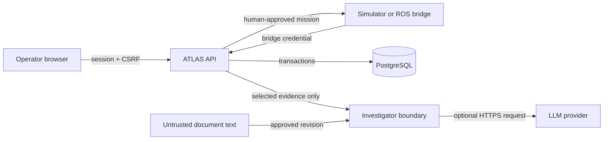

# ATLAS threat model

Status: implemented controls and residual risks for the synthetic portfolio
deployment. Last reviewed: 2026-10-08.

## Scope and security objectives

This model covers the FastAPI service, PostgreSQL records, browser dashboard,
simulator, ROS bridge, technical-document library, and optional LLM provider.
Gazebo, Nav2, the host operating system, reverse proxy, and physical robot
safety are outside the current runtime boundary.

ATLAS must:

1. prevent unauthenticated access to operational records and mutations;
2. prevent robot observations from being forged, silently replaced, or applied
   twice;
3. preserve mission and approval state despite stale or concurrent requests;
4. keep model output outside every operational write path;
5. attribute human changes to an authenticated actor; and
6. avoid sending records outside the evidence required for one investigation.

## Assets

| Asset | Required property |
| --- | --- |
| Mission state and waypoints | Integrity and attributable approval |
| Telemetry and incident evidence | Integrity, provenance, availability |
| Human sessions and CSRF tokens | Confidentiality and authenticity |
| Bridge and model API credentials | Confidentiality and rotation outside source control |
| Technical documents | Approved revision integrity and provenance |
| Maintenance tickets and resolutions | Authorization and auditability |
| Investigation output | Evidence grounding, uncertainty, reproducibility |
| Audit history | Integrity and actor attribution |

Synthetic records are not confidential customer data, but ATLAS still treats
them as operational data so the architecture exercises realistic boundaries.

## Trust boundaries

- Browser input, telemetry, technical-document text, and model output are
  untrusted.
- The API is the authorization and state-transition boundary.
- The investigator has no database session, robot command, ticket, or mission
  mutation capability.
- PostgreSQL constraints and transactions protect durable state; dashboard
  controls are not security controls.

## Threat and control matrix

| ID | Threat | Control | Verification |
| --- | --- | --- | --- |
| T01 | Anonymous user reads fleet, missions, events, or incidents | Operational reads require either a valid human session or bridge credential | `test_operational_reads_require_session_or_valid_bridge` |
| T02 | Attacker forges a robot observation | Constant-time bridge-key validation before telemetry storage or state changes | `test_forged_bridge_cannot_ingest_telemetry` |
| T03 | Captured telemetry is replayed | Stable event ID and identical-payload idempotency | `test_fleet_and_failure_duplicate`, `test_concurrent_duplicate_delivery` |
| T04 | An event ID is reused with altered content | Existing ID plus different canonical payload returns conflict | `test_event_id_substitution_is_rejected_without_state_change` |
| T05 | Stale telemetry regresses current robot or mission state | Occurrence-time comparison and terminal-state checks | `test_stale_event_does_not_regress_state`, `test_late_previous_mission_cannot_fail_new_mission` |
| T06 | User performs an action outside their role | Server-side RBAC dependencies on every administrative and operational write | `test_non_admin_cannot_access_administration` and ticket authorization tests |
| T07 | Cross-site request reuses an authenticated browser session | Per-session CSRF secret, strict SameSite cookie, write checks | `test_csrf_token_cannot_be_replayed_with_another_session` |
| T08 | Session token is fixed or retained after logout | Server-generated random token, stored digest, server-side deletion | `test_logout_revokes_server_session` |
| T09 | Two operators race the same transition | Database transaction, row lock, and explicit state precondition | `test_concurrent_approval_only_one_running` |
| T10 | Malicious document instructs the model to bypass policy | Document text is labeled untrusted; closed output schema and citation allowlist | `test_document_prompt_injection_is_delimited_as_untrusted_evidence` |
| T11 | Model fabricates evidence or returns a command field | Exact evidence allowlist, required citations, forbidden extra fields, deterministic fallback | LLM adversarial tests in `test_llm_investigator.py` |
| T12 | Model or provider becomes unavailable | Bounded timeout and deterministic local fallback | `test_provider_failure_falls_back_without_exposing_error_text` |
| T13 | Model causes a ticket, approval, or robot command | Investigator exposes read-only data transformation only; writes remain separate authenticated routes | Investigation tool-trace and approval workflow tests |
| T14 | Unapproved technical guidance enters an investigation | Only approved document revisions are retrieved; approvals are administrative and audited | document revision tests in `test_investigation.py` |
| T15 | Stored text executes in a downloaded report | Context escaping before HTML rendering | report injection tests in `test_reports.py` |
| T16 | Credentials leak through logs or source | Structured log field allowlist, `.env` exclusion, placeholders in examples | observability credential-redaction tests and repository scan |

## Abuse cases

### Compromised robot bridge

A bridge credential permits telemetry ingestion and operational reads required
for mission polling. It does not permit mission approval, ticket creation,
document approval, user administration, or investigation execution. Replayed
events cannot create additional records, while modified replays are rejected.

### Compromised technician account

A technician can investigate incidents and work only tickets assigned to that
account after approval. It cannot create or approve missions, approve tickets,
manage users, approve documents, or read administrative audit history.

### Malicious technical document

Document text can contain instructions aimed at the model. ATLAS sends it as
untrusted evidence inside a delimited JSON envelope. The returned object must
match the closed schema and reference only selected evidence. This reduces the
impact of prompt injection but does not prove that model-generated prose is
correct; human review and evaluation remain necessary.

## Residual risks and planned controls

- The prototype uses one shared bridge credential. A production deployment
  needs per-robot identities, rotation, revocation, and preferably mTLS.
- Human authentication is local. Enterprise deployment needs an external
  identity provider, MFA, account recovery, and centralized session revocation.
- Login throttling and heartbeat monitoring are process-local and assume one
  API worker.
- Audit records are stored in the primary database and are not tamper-evident
  against a database administrator.
- The optional provider sees the selected synthetic evidence envelope. A real
  deployment needs a data-processing agreement, retention controls, redaction,
  and an approved model endpoint.
- Availability under database, network, or container failure has not yet been
  established by chaos testing.
- This model makes no physical safety, functional safety, or cybersecurity
  certification claim.

## Review rule

Any new endpoint, tool, external provider, robot command, data category, or
authorization role must update this document and add a corresponding test when
the control is executable.
